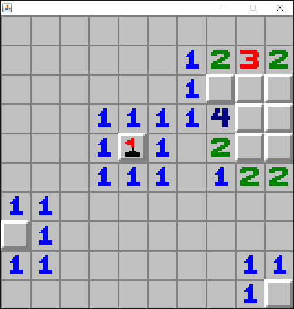

# java-minesweeper-clone
A Minesweeper clone written in Java.

A class project under the direction of Dr. Venkat Subramaniam (http://www2.cs.uh.edu/~svenkat/). 
Course: Software Design (COSC 4353) 
Pair programming partner: https://github.com/baz606 
Focus on test first development, automated testing, and continuous integration.

Original Minesweeper images belong to Microsoft, of course.

